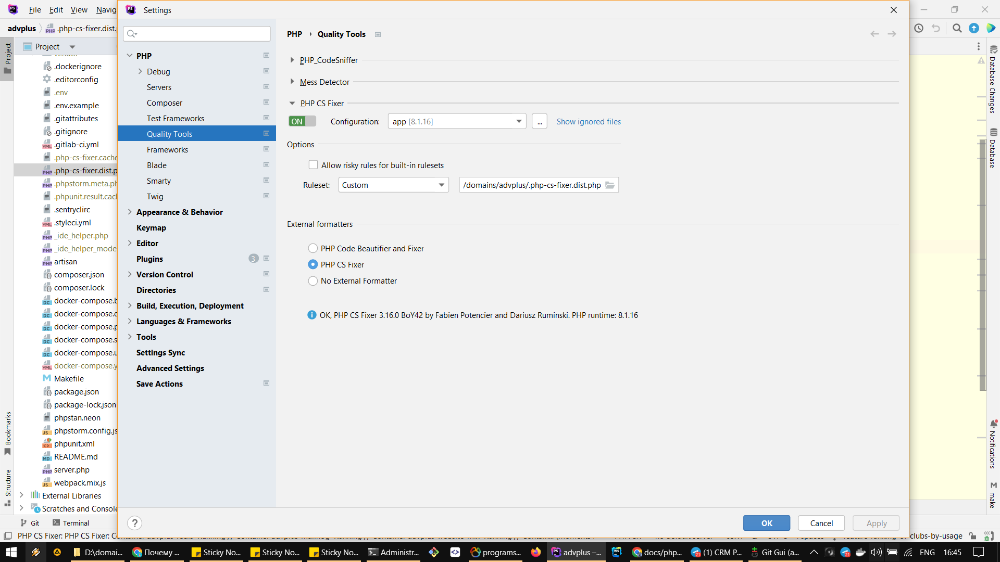
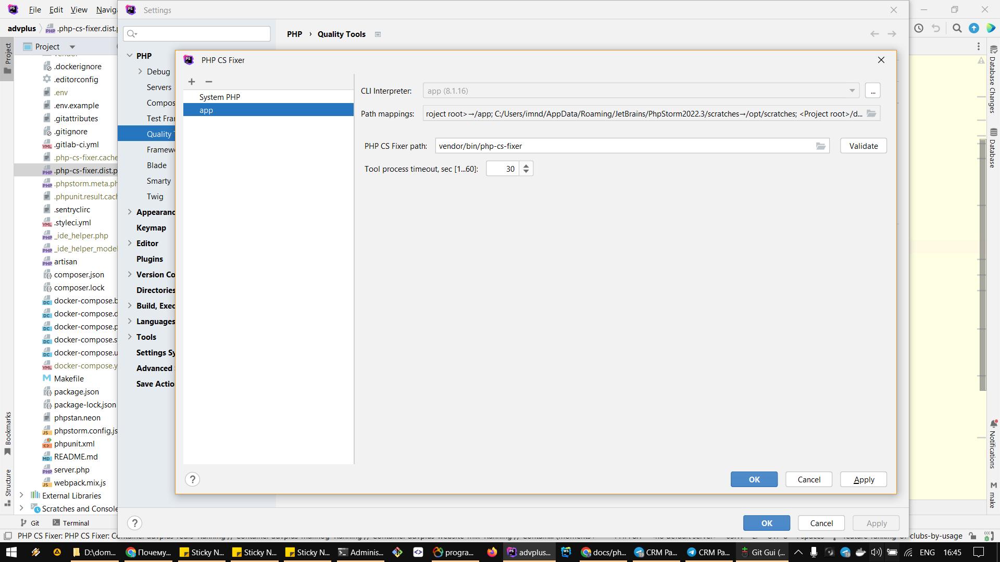

## PHP Storm csfixer

Go to ```Settings > PHP```

Select ```Quality Tools```



Select ```app``` from the ```Configuration dropdown```

Configure the csfixer ruleset path

Click on the button near ```Configuration dropdown```



Configure csfixer path
