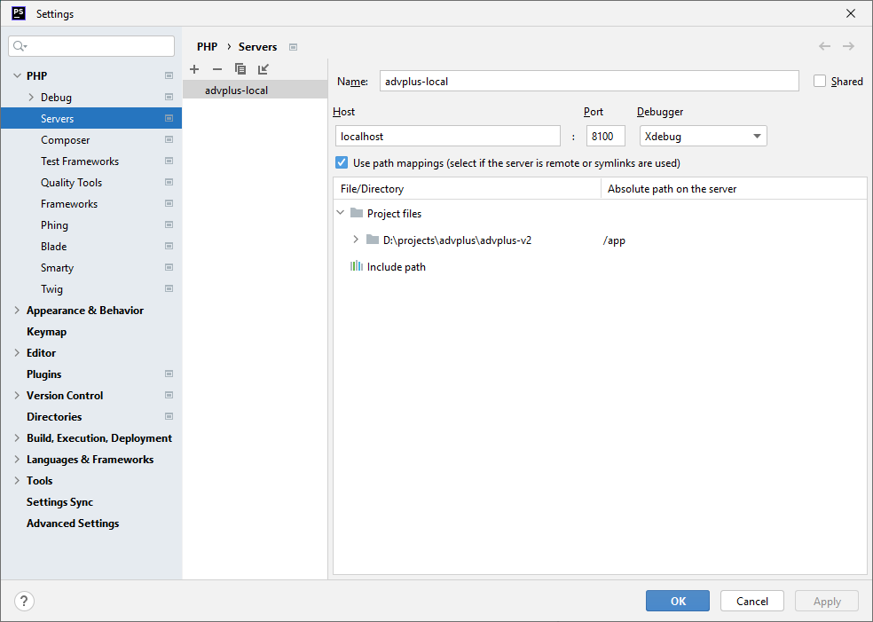

## PHP Storm Interpreter

Setup [Interpreter](../interpreter/README.md)

Go to
```Settings > PHP > Servers```

Select ```PHP language level: 8.1```

Add new with name ```advplus-local``` from ```Docker```



Change ```Absoulte Path on the server``` for your project path to ```/app```
