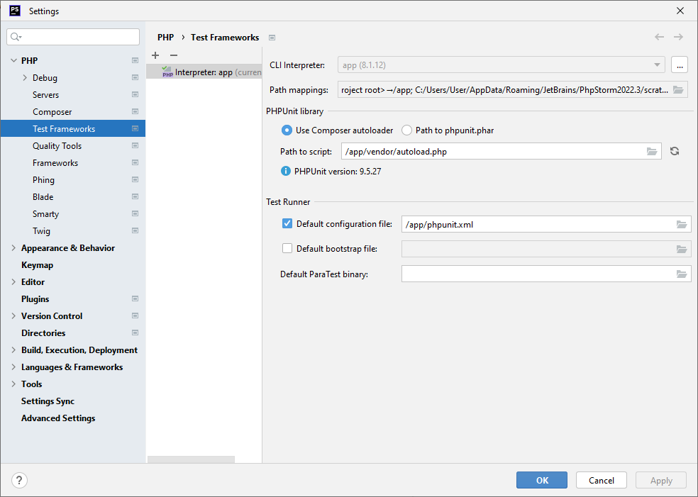

## PHP Storm Interpreter

Setup [Interpreter](../interpreter/README.md)

Go to
```Settings > PHP > Test Frameworks```

Create new ```PHP Unit Remote interpreter``` with ```app interpreter```

Add _Path to script_ ```/app/vendor/autoload.php``` and _Default configuration_ ```/app/phpunit.xml```


