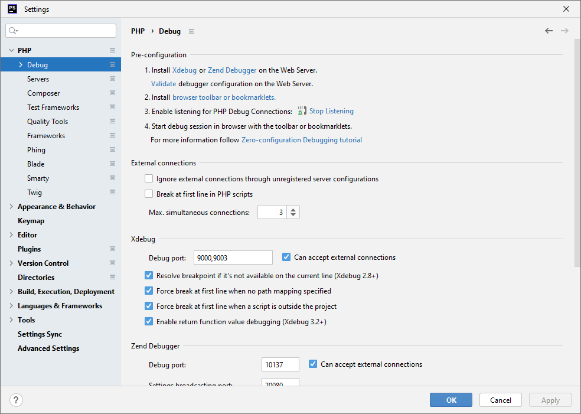

## Xdebug 3

Setup [Interpreter](../interpreter/README.md), [Server](../server/README.md)

Uncomment line in ```docker/dev/docker-xdebug.ini```

```ini
; zend_extension = xdebug
```

Restart ```app``` container

_Enable listening for PHP Debug Connections_ (3rd in list)



You can turn off notifications about "Debug sessions without pause"
