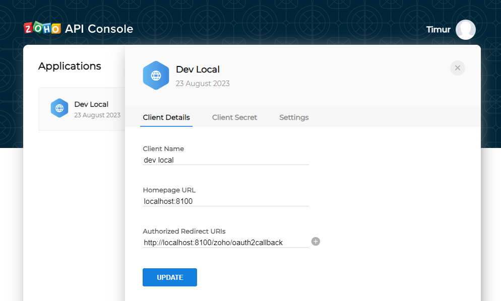
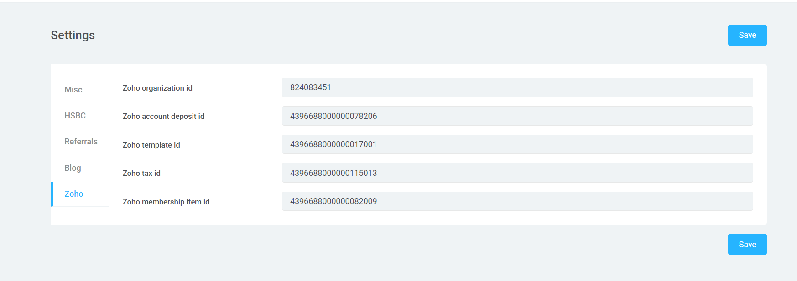

## Zoho Books Service

### Deploy and use guide

1. Get client_id and client_secret.
   Create Server-based Applications in https://accounts.zoho.com/developerconsole.

Fill:

- "Homepage URL" - localhost:8100

- "Authorized Redirect URIs" - http://localhost:8100/zoho/oauth2callback
- 


2. Fill variables in .env. Some descriptions in config/zoho.php
```dotenv
ZOHO_CLIENT_ID=
ZOHO_CLIENT_SECRET=
```
3. Run auth command
```bash
make art zoho:auth
```
4. Follow the link you received and login
5. Tokens will be recorded in zoho_oauth table.
6. Get settings ids:
```bash
make art zoho:settings_ids
```
7. Fill settings in admin panel:



8. Enjoy

### Once sync

1. Save accountants (chart of accounts) from zoho
```bash
make art zoho:save_chartofaccounts
```
2. Save customers from zoho to our table
```bash
make art zoho:save_customers
```
3. Sync members to zoho (create customers)
```bash
make art zoho:sync_members
```
4. Save invoices from zoho to our table
```bash
make art zoho:save_invoices
```
5. Match invoices from zoho to our exists payments
```bash
make art zoho:match_invoices
```
6.Sync monthly payments to zoho invoices
```bash
make art zoho:sync_recurring_invoices
```
### Additional information

API: https://www.zoho.com/books/api/v3/introduction/

Service: https://books.zoho.com/

Developer console: https://accounts.zoho.com/developerconsole
